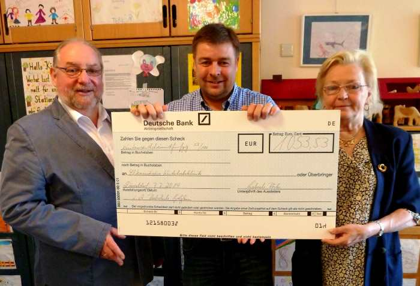

Bei der Vorbereitung ihrer Abschlussfeier haben die Sch&uuml;lerinnen und Sch&uuml;ler der vier 10. Klassen der Realschule Golzheim den Wunsch ge&auml;u&szlig;ert, den Kindern in der Kinderkrebsklinik des Universit&auml;tsklinikums D&uuml;sseldorf eine Spende zukommen zu lassen. Aus diesem Grund haben sie im Rahmen ihrer Abschlussfeierlichkeiten eine Spendensammlung unter Sch&uuml;lern, Eltern und Lehrern durchgef&uuml;hrt. Heute wurde der stolze Erl&ouml;s in H&ouml;he von 1053,53 € dem Vertreter der Elterninitiative Kinderkrebsklinik e.V., Herrn Fle&szlig;er, &uuml;berreicht.

Fotos: Scheck&uuml;berreichung durch Frau R&ouml;sler und Herrn Maa&szlig;en von der Realschule Golzheim an Herrn Fle&szlig;er (Mitte) von der Elterninitiative Kinderkrebsklinik e.V. 
