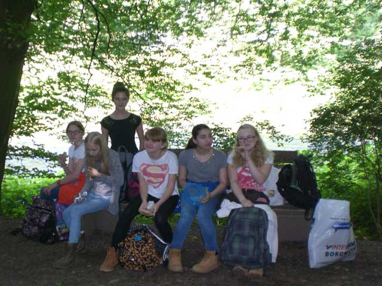
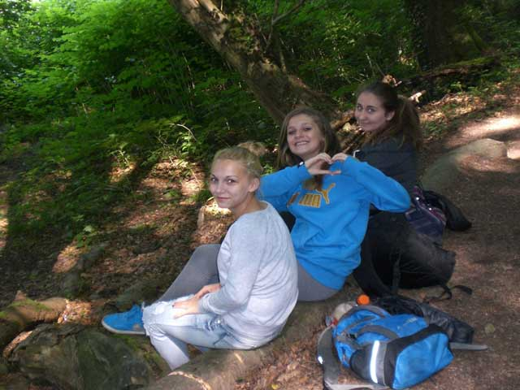
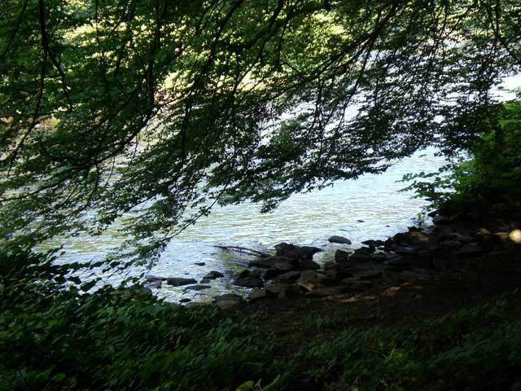
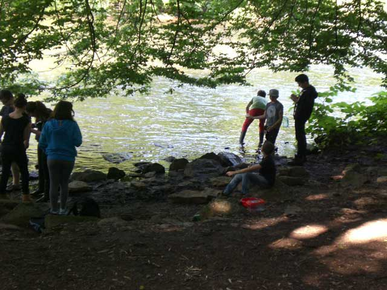
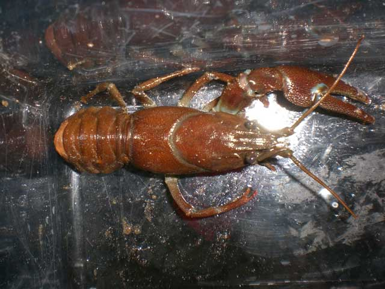
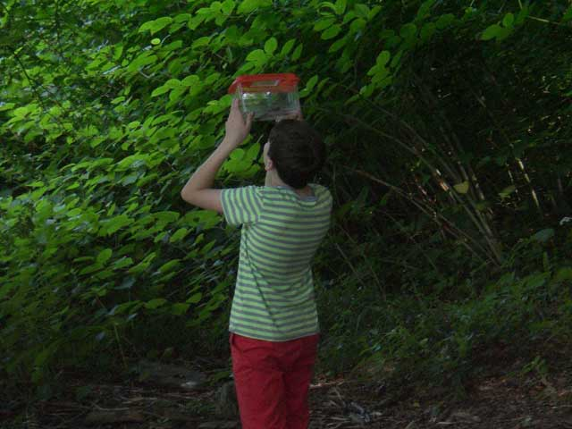

Der 7sw- Kurs unternahm am 03.06.14 zusammen mit Herrn Dietrich im Rahmen der Unterrichtsreihe „Gew&auml;sser&ouml;kologie” eine Exkursion zur Wupper, um dort eine Flie&szlig;gew&auml;sseruntersuchung durchzuf&uuml;hren.

Von Solingen- Krahenh&ouml;he ausgehend wanderten wir zun&auml;chst durch die Wupperberge zu einem Flachwasserbereich in Solingen- Burg. Dort angekommen machten wir erst einmal Pause und fr&uuml;hst&uuml;ckten mitten im Gr&uuml;n.

Ausgestattet mit Fangnetzen, Becherlupen und Bestimmungsschl&uuml;sseln suchten wir im Wasser nach allem, was „kreucht und fleucht” und machten uns dann an die Bestimmung. Unter anderem fanden wir dort Bachflohkrebse, junge Bachforellen, K&ouml;cherfliegenlarven, Steinfliegenlarven und, unser Highlight, einen ausgewachsenen Flusskrebs (der vermutlich einen Kampf mit einem Rivalen ausgefochten hatte). 

Die gefundenen Zeigerorganismen lie&szlig;en den Schluss zu, dass sich der Wupperabschnitt, an dem wir uns aufhielten, zwischen den Gew&auml;sserg&uuml;teklassen I und II befindet, also gering bis m&auml;&szlig;ig mit Schadstoffen belastet ist. 

